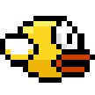

# Flappy Bird by K1rtash

 

### 🎨 Assets
All assets used in this proyect are either original or free of use. 

### 🎮 Features
- Space to jump
- Lose if the player touches the pipes
- Difficulty increases with time
- Highscore is saved
- Game can be installed and unistalled using the setup wizzard

### ⚙️ Setup
To use the proyect, either compile from source with the CMake, or [download a release](https://github.com/K1rtash/flappy_bird-sfml/releases). 

### 🕹️ K1rtash Games
https://discord.gg/Tvcasfq7GB